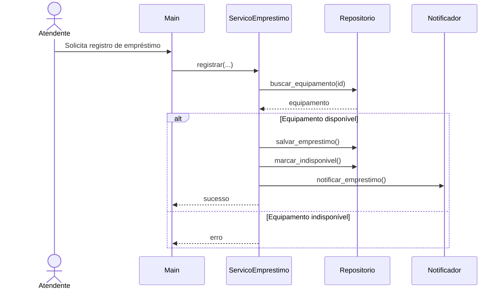
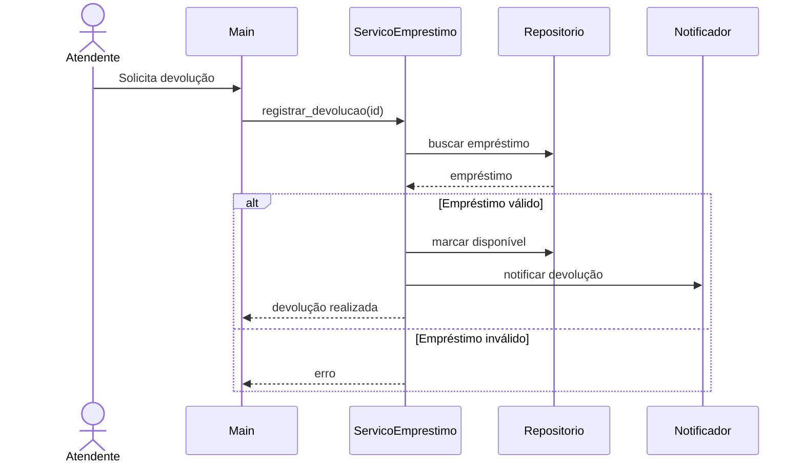
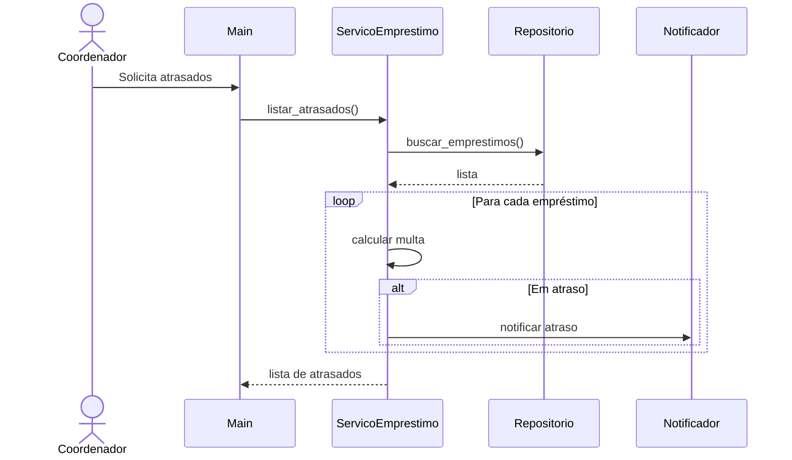
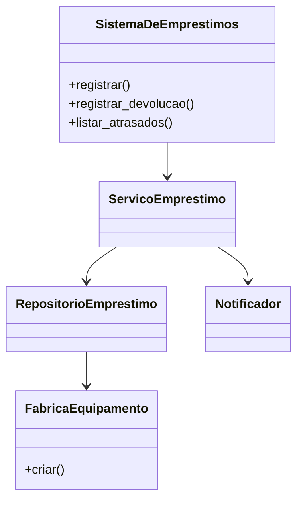

# Diagramas e Decomposição

## Visão Geral

A estrutura proposta para a versão 2.0 busca resolver os problemas identificados na versão inicial do sistema, principalmente aqueles relacionados à concentração de responsabilidades, dificuldade de manutenção e baixa testabilidade.

A solução adotada segue a arquitetura em camadas definida no ADR-001, separando os componentes conforme suas responsabilidades.

---

# Decomposição do Sistema

## Camada de Modelos (models)

### Equipamento

Responsável por representar os equipamentos cadastrados no sistema.

A classe define os atributos comuns dos equipamentos e estabelece o contrato para cálculo de multas através do método `calcular_multa()`.

Subclasses especializadas implementam as regras específicas de cada tipo de equipamento.

### Emprestimo

Responsável por representar um empréstimo realizado.

Armazena informações como:

- identificador;
- equipamento associado;
- nome do solicitante;
- e-mail;
- data prevista para devolução;
- situação do empréstimo;
- valor da multa.

---

## Camada de Serviços (services)

### ServicoEmprestimo

Centraliza as regras de negócio relacionadas ao processo de empréstimo.

Principais responsabilidades:

- registrar empréstimos;
- registrar devoluções;
- calcular multas;
- verificar atrasos;
- solicitar notificações.

### Notificador

Responsável pela comunicação com os usuários.

Suas funções incluem:

- informar empréstimos realizados;
- informar devoluções;
- informar situações de atraso.

A separação dessa responsabilidade evita que regras de negócio fiquem misturadas com mecanismos de comunicação.

---

## Camada de Persistência (repositories)

### RepositorioEmprestimo

Responsável pelo gerenciamento dos dados do sistema.

Funções principais:

- armazenar equipamentos;
- armazenar empréstimos;
- localizar registros;
- atualizar disponibilidade dos equipamentos.

---

## Camada de Interface

### main.py

Responsável pela interação direta com o usuário.

Apresenta o menu principal, recebe entradas e encaminha as solicitações para os serviços apropriados.

Não contém regras de negócio.

---

# Diagrama de Sequência — UC01 Registrar Empréstimo

---

# Diagrama de Sequência — UC02 Registrar Devolução

---

# Diagrama de Sequência — UC03 Listar Empréstimos em Atraso

---

# Justificativa da Decomposição

A divisão adotada procura aumentar a coesão interna dos módulos e reduzir o acoplamento entre componentes.

Cada camada possui uma responsabilidade específica:

- Models representam entidades do domínio.
- Services implementam regras de negócio.
- Repositories gerenciam dados.
- Main realiza interação com o usuário.

Essa organização facilita manutenção, evolução e testes isolados, contribuindo diretamente para o atendimento dos requisitos RNF03 e RNF04.

---

# Diagrama Simplificado após Refatoração

